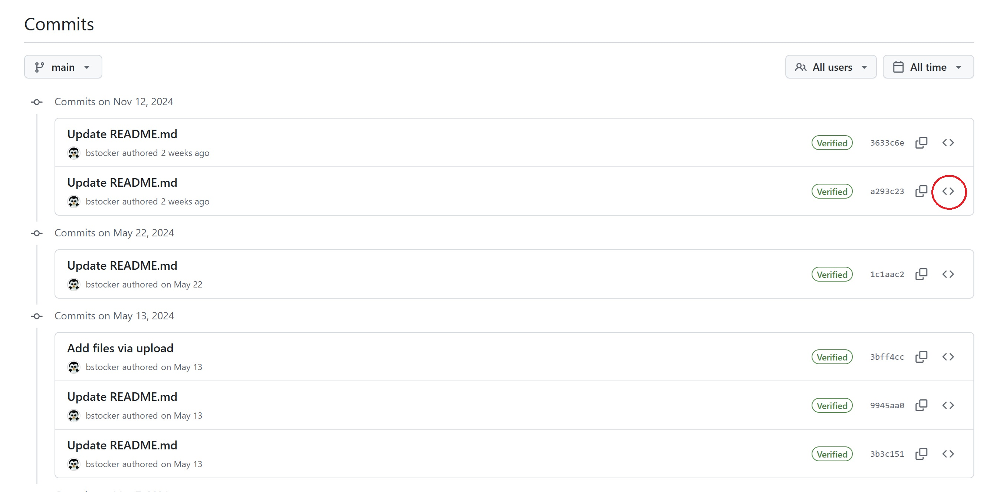
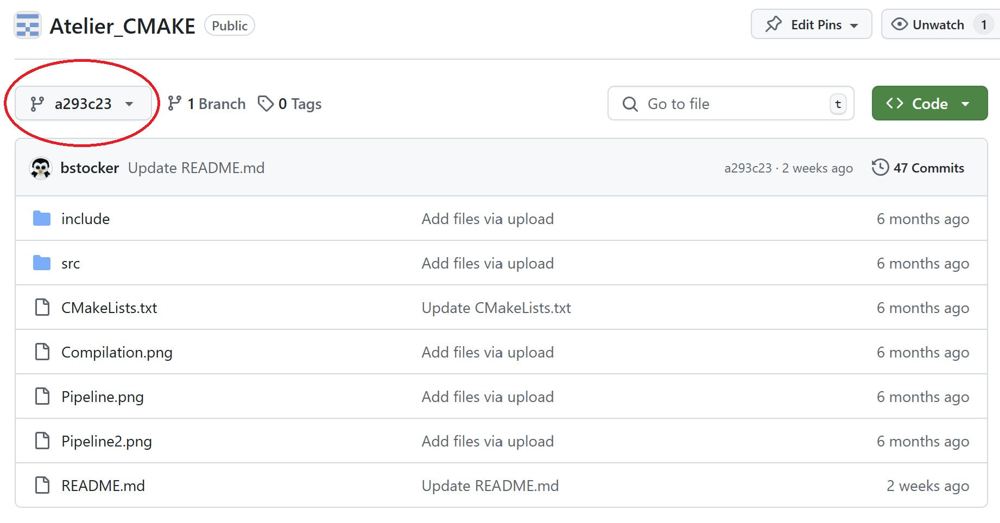
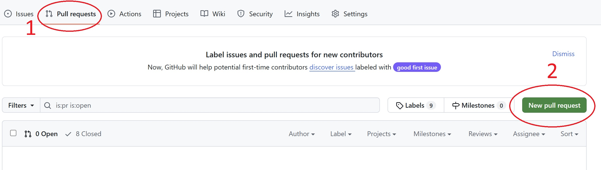

------------------------------------------------------------------------------------------------------
PROCESSUS DE RESTAURATION GITHUB
------------------------------------------------------------------------------------------------------
Suite à une modification de code dans GitHub, votre solution ne fonctionne plus. Vous devez donc restaurer votre code mais comment faire.  
Cette procédure vous accompagne étape par étape pour restaurer le code issue de votre historique (vos commits).  

-------------------------------------------------------------------------------------------------------
Séquence 1 : Historique des commits
-------------------------------------------------------------------------------------------------------
L'historique de vos commits vous donne accès à vos différentes versions de votre code.  
A chaque commit, un point de sauvegarde est créé dans GitHub.  

Cliquez sur Commits pour accèder à votre historique de commits  
  
   

Sélectionnez le sauvegarde que vous souhaitez restaurer.  

   

A présent vous n'êtes plus dans votre branche main (branche principale) mais vous naviguez dans un point de restauration (votre code du passé).  

   

Votre objectif à présent est de faire de ce point de sauvegarde une nouvelle branche que vous fusionnerez ensuite à votre branche principale (main).  
Créez votre nouvelle branche.  


Vous devez pour cela demander à faire un "Pull requests".  

   


**Procedure à suivre :**  
1° - Créez vous un compte sur GitHub : https://github.com/  
Si besoin, une vidéo pour vous aider à créer votre propre compte GitHUB : [Créer un compte GitHUB](https://docs.github.com/fr/get-started/onboarding/getting-started-with-your-github-account)  
A noter que **si vous possédez déjà un compte GitHUB, vous pouvez le conserver pour réaliser cet atelier**. Pas besion d'en créer un nouveau.  
Remarque importante : **Lors de votre inscription, utilisez une adresse mail valide. GitHUB n'accepte pas les adresses mails temporaires**  

2° - Faites un Fork du Repository suivant : [CMAKE](https://github.com/OpenRSI/Atelier_CMAKE.git)  
Voici une vidéo d'accompagnement pour vous aider dans les "Forks" : [Forker ce projet](https://youtu.be/p33-7XQ29zQ)    
  
**Travail demandé :** Créé votre compte GitHUB, faites le fork de ce projet et **copier l'URL de votre Repository GitHUB dans la discussion public**.

Notion acquise lors de cette séquence :  
Vous avez appris lors de cette séquence à créer des Repository pour stocker et travailler avec votre code informatique. Vous pourez par la suite travailler en groupe sur un projet. Vous avez également appris à faire des Forks. C'est à dire, faire des copies de projets déjà existant dans GitHUB que vous pourrez ensuite adapter à vos besoins.
  
---------------------------------------------------
Séquence 2 : Création d'une action GitHub
---------------------------------------------------
Objectif : Créer un script pour automatiser vos tests  
Difficulté : Simple (~20 minutes)
---------------------------------------------------

Dans votre repository GitHUB, créer un fichier **.github/workflows/tests.yml** et y copier le code ci-dessous (Remarque : Attention à bien mettre le point devant le répertoire .github) :
```
name: Automatisation des tests
on: push
jobs:
  Compilation:
    runs-on: ubuntu-latest
    steps:
      - name: Compilation
        run: |
          last_directory=$(basename ${{ runner.workspace }})
          git clone https://github.com/${{ github.repository }}.git
          cd ./$last_directory
          mkdir build
          cd build
          cmake ..
          make
          make test
```
**C'est fini !**  
La serie de tests présent dans votre fichier CMakeLists.txt à la racine de votre projet sera automatiquement executée à chaque Commit de votre projet (c'est à dire à chaque modification de votre code).  
```
add_test(t1 src/calculator add 2 3)
add_test(t2 src/calculator sub 3 -2)
add_test(t3 src/calculator mul 5 5)
add_test(t4 src/calculator div 1 5)
```

Vous pouvez observer le résutat de vos tests dans les logs de votre Action :  
  
  
**Travail demandé**  
Créer votre première Action GitHub et observez le résultat dans les logs de vos Actions.  

**Notions acquises de cette séquence**    
Vous avez vu dans cette séquence comment créer des Actions GiHUB pour automatiser vos tests.  
Dans le script que nous venons de voir à l'instant, celui-ci compile le code C dans un premier temps puis exécute une série de tests présent dans le fichier CMakeLists.txt via la commande make test. A noter que tout les fichiers .yml déposés dans le répertoire .github/workflows/ de votre projet seront systématiquement exécutés à chaque Commit réalisé.    

---------------------------------------------------------------------------------------------
Séquence 3 : Exercice 1
---------------------------------------------------------------------------------------------
Objectif : Ajouter une fonction au Carré  
Difficulté : Moyenne (~60 minutes)
---------------------------------------------------------------------------------------------
Dans cet exercice vous devez modifier votre code C afin de créer et tester une nouvelle fonction au "Carré".  
L'appel de la fonction est le suivant : **src/calculator car 5** (et doit retournée la valeur 25)  

**Travail demandé :**  
Modifiez votre code afin de créer et tester automatiquement cette nouvelle fonction au carré.  
Indice : Les fichiers à modifier sont les suivants  
  - src/main.c
  - src/lib/calculator.c
  - include/calculator.h
  - et pour l'automatisation des tests, le fichier CMakeLists.txt
    
Notions acquises de cette séquence :  
Vous avez vu dans cette séquence comment mettre en place de l'industrialisation continue.  
  
---------------------------------------------------
Séquence 4 : Votre premier pipeline
---------------------------------------------------
Objectif : Créer votre pipeline de jobs  
Difficulté : Faible (~10 minutes)
---------------------------------------------------
Automatiser vos tests via le fichier CMakeLists.txt c'est bien mais vous souhaiteriez peut-être avoir plus de contrôle dans l'execution de ces tests. Par exemple, pouvoir paralléliser ces tests, ou poursuivre des tests même lorsqu'un test est en echec.  

Copier/Coller le code ci-dessous à la suite de votre fichier tests.yml et observez le résultats dans vos Actions Github (et dans les logs).  
```
  Test_Add:
    runs-on: ubuntu-latest
    needs: Compilation
    steps:
      - name: Test fonction add
        run: |
          last_directory=$(basename ${{ runner.workspace }})
          git clone https://github.com/${{ github.repository }}.git
          cd ./$last_directory
          mkdir build
          cd build
          cmake ..
          make
          ./src/calculator add 10 5
```
---------------------------------------------------
Séquence 5 : Exercice 2
---------------------------------------------------
Objectif : Paralléliser vos tests  
Difficulté : Moyenne (~30 minutes)
---------------------------------------------------
Vous allez dans cet exercice paralléliser tous vos tests afin d'obtenir le résultat ci-dessous :    
  
    

Puis pour finir ajoutez un tout dernier job "Deploy". Ce dernier job ne fera qu'un echo "Déploiement de la solution".  
Pour ce tout dernier exercice, vous devierez obtenir le résultat ci-dessous :  

    
